# Eclipse With Hadoop

These steps will guide you to integrate Java Eclipse with Hadoop.

## Setting up Eclipse


* Download Eclipse for Ubuntu using this Link: [Here](https://ftp.harukasan.org/eclipse/oomph/epp/2019-12/R/eclipse-inst-linux64.tar.gz)
* Extract the `eclipse-inst-linux64.tar.gz` file to `path-to-folder/eclipse-installer`.
* Move to the directory `path-to-folder/eclipse-installer` .
* Double click on `eclipse-inst` file to execute.
* In Eclipse Installer, choose `Eclipse IDE for Java Developers`
* Note the Installation directory.
* Click on Install Button.
* Launch the IDE.
* Right click on Eclipse Icon on Ubuntu Launcher and select `Lock to Launcher` for easy accessibility.

## Integrating with Hadoop

* Open Eclipse IDE.
* Create a new JAVA Project and Name it `ExampleHadoop` and Click `Finish`
  <br>
  
  <br>
  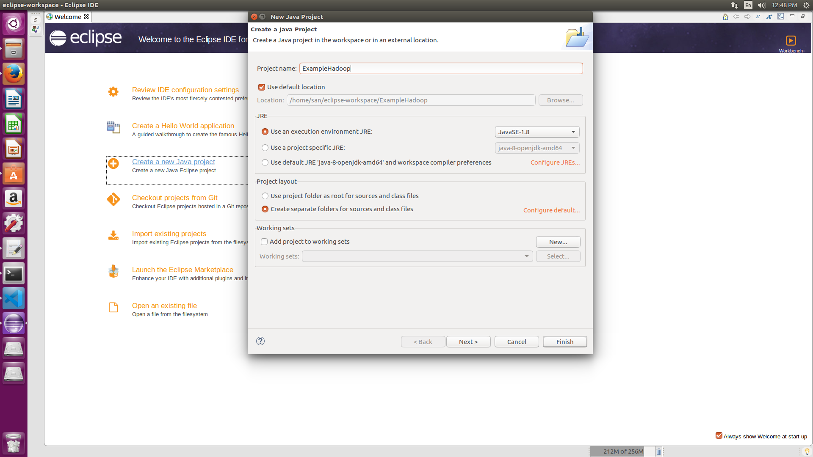

* Right Click on Project > New > Package ( Name it - demo) > Finish.
  <br>
  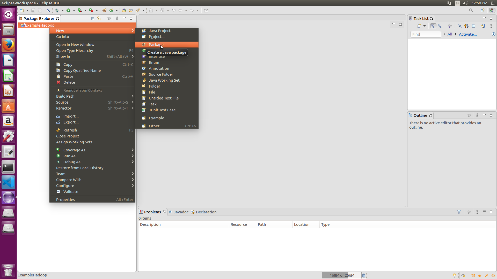
  <br>
  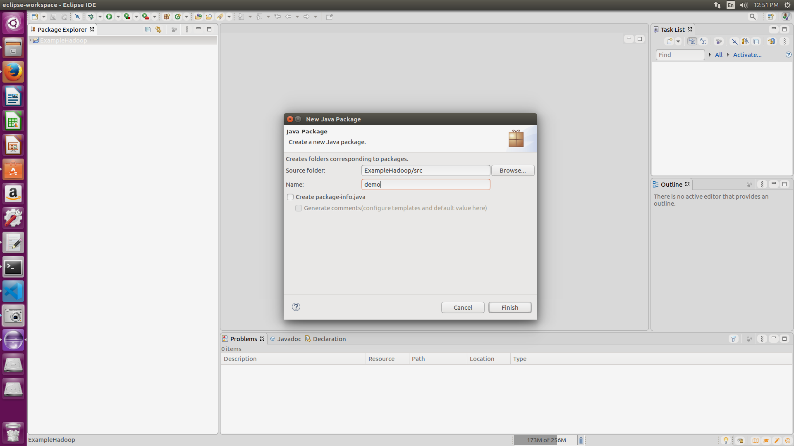
* Right Click on Package > New > Class (Name it - WordCount).
  <br>
  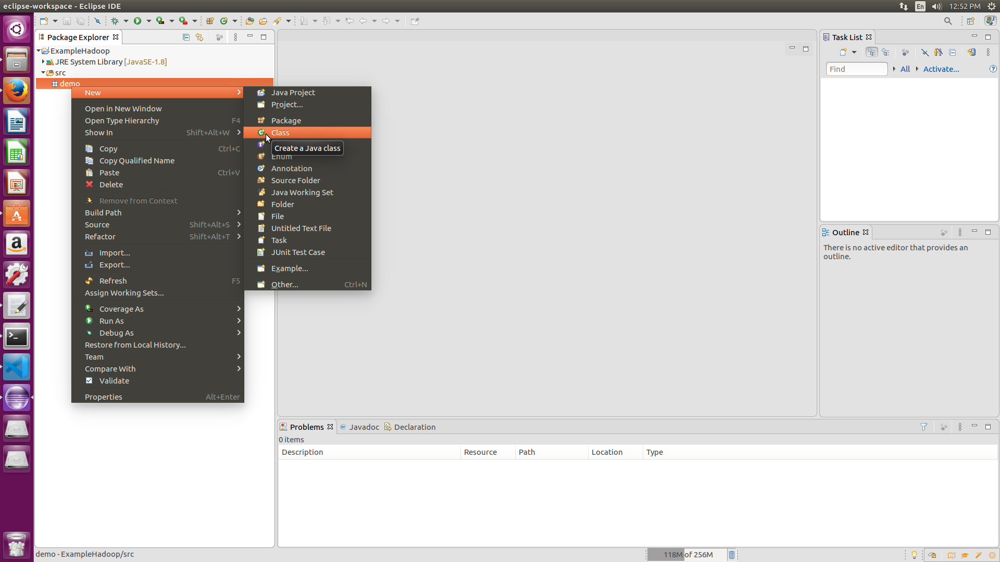
  <br>
  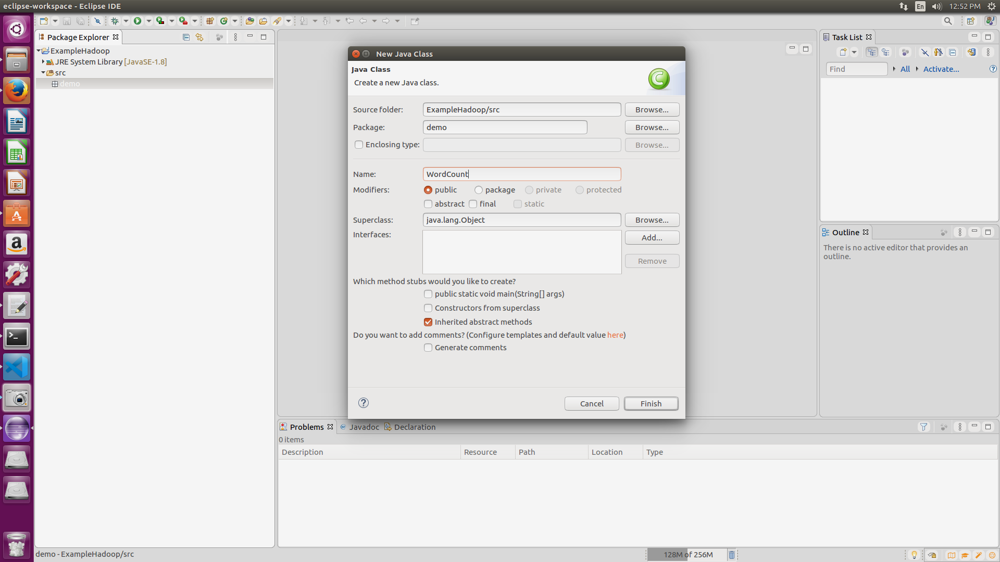
  <br>
* Add Following Reference Libraries:

    Right Click on Project > Build Path> Add External Jars > Apply and Close

        /usr/local/hadoop/hadoop-core.jar

        /usr/local/hadoop/lib/Commons-cli-1.2.jar
   
  <br>
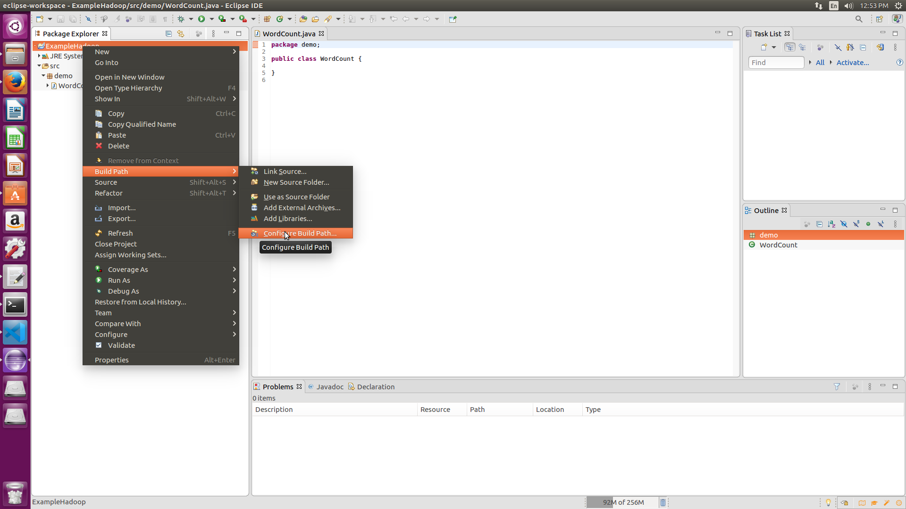
  <br>
  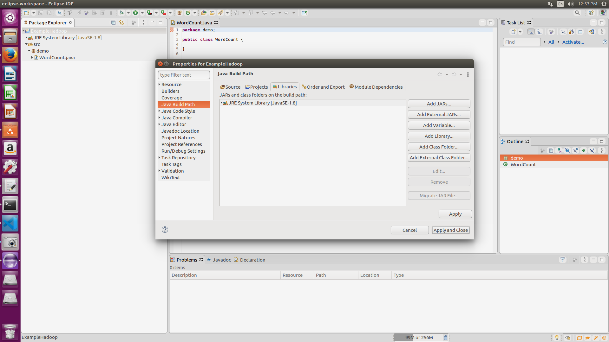
  <br>
  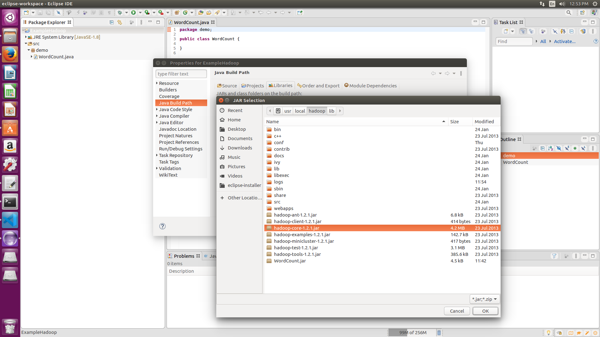
  <br>
  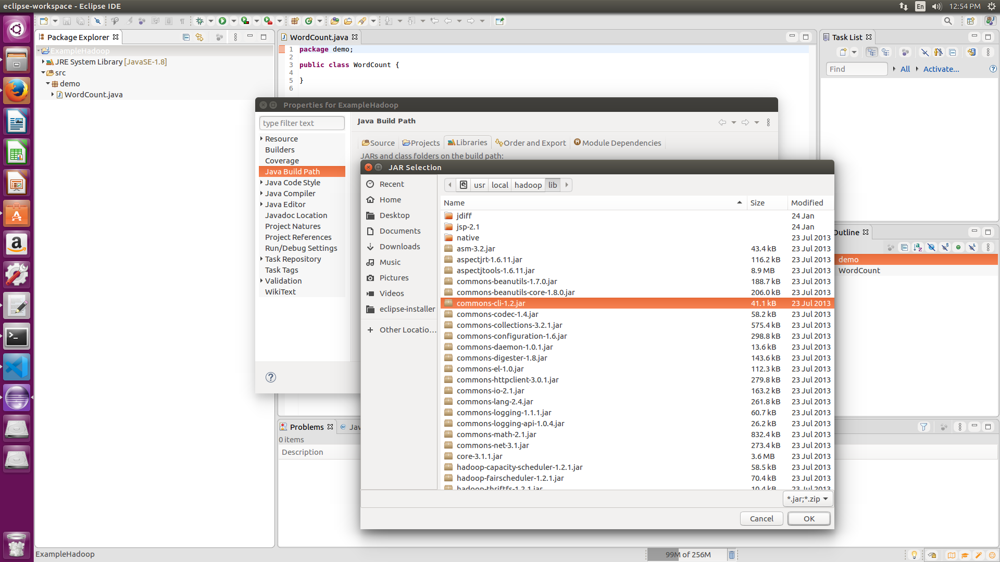
  <br>
* Add the following code into WordCount.java
  ```
    package demo;

    import java.io.IOException;

    import org.apache.hadoop.conf.Configuration;

    import org.apache.hadoop.fs.Path;

    import org.apache.hadoop.io.IntWritable;

    import org.apache.hadoop.io.LongWritable;

    import org.apache.hadoop.io.Text;

    import org.apache.hadoop.mapreduce.Job;

    import org.apache.hadoop.mapreduce.Mapper;

    import org.apache.hadoop.mapreduce.Reducer;

    import org.apache.hadoop.mapreduce.lib.input.FileInputFormat;

    import org.apache.hadoop.mapreduce.lib.output.FileOutputFormat;

    import org.apache.hadoop.util.GenericOptionsParser;

    public class WordCount {

    public static void main(String [] args) throws Exception

    {

    Configuration c=new Configuration();

    String[] files=new GenericOptionsParser(c,args).getRemainingArgs();

    Path input=new Path(files[0]);

    Path output=new Path(files[1]);

    Job j=new Job(c,"wordcount");

    j.setJarByClass(WordCount.class);

    j.setMapperClass(MapForWordCount.class);

    j.setReducerClass(ReduceForWordCount.class);

    j.setOutputKeyClass(Text.class);

    j.setOutputValueClass(IntWritable.class);

    FileInputFormat.addInputPath(j, input);

    FileOutputFormat.setOutputPath(j, output);

    System.exit(j.waitForCompletion(true)?0:1);

    }

    public static class MapForWordCount extends Mapper<LongWritable, Text, Text, IntWritable>{

    public void map(LongWritable key, Text value, Context con) throws IOException, InterruptedException

    {

    String line = value.toString();

    String[] words=line.split(",");

    for(String word: words )

    {

        Text outputKey = new Text(word.toUpperCase().trim());

    IntWritable outputValue = new IntWritable(1);

    con.write(outputKey, outputValue);

    }

    }

    }

    public static class ReduceForWordCount extends Reducer<Text, IntWritable, Text, IntWritable>

    {

    public void reduce(Text word, Iterable<IntWritable> values, Context con) throws IOException, InterruptedException

    {

    int sum = 0;

    for(IntWritable value : values)

    {

    sum += value.get();

    }

    con.write(word, new IntWritable(sum));

    }

    }

    }

  ```

* Save the Jar file to destination Folder.
  Right Click on Project> Export> Select export destination as Jar File  > next> Finish.
    <br>
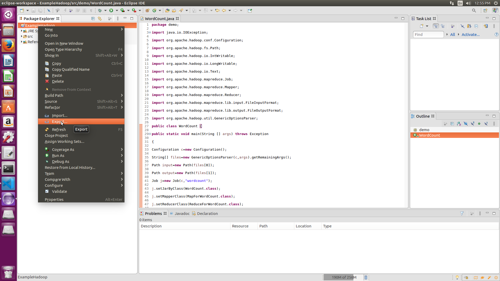
    <br>
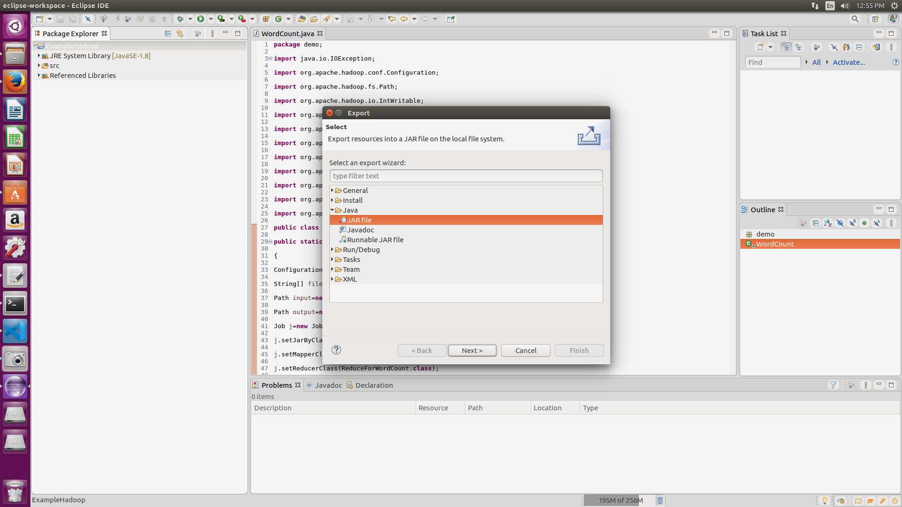
    <br>
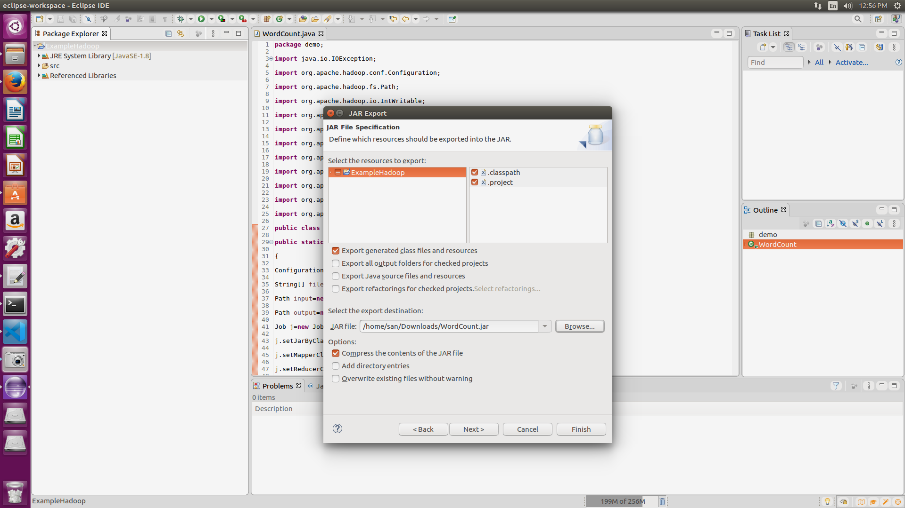
    <br>

## Running the jar File with Hadoop

* `cd /usr/local/hadoop`
* `bin/start-all.sh`
* Create a input.txt file:
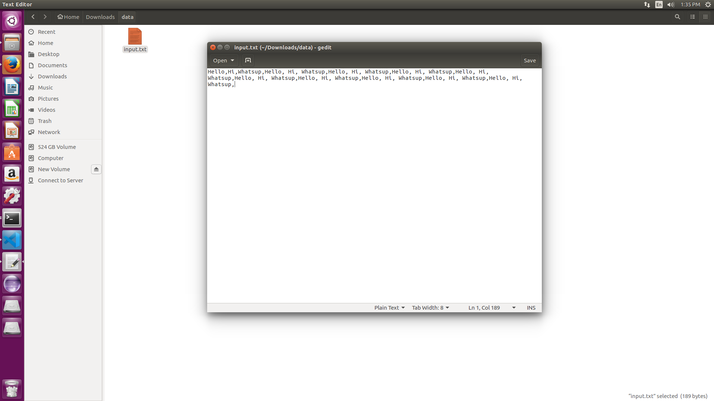 
* Take a input text file and move it into HDFS format:
    ```
    bin/hadoop fs -put /home/san/Downloads/data/input.txt data/input.txt
    ```


* Run the jar file:
    ```
    bin/hadoop jar /home/san/Downloads/WordCount.jar demo.WordCount data/input.txt MRDir3
    ```
* Open the result:
    * Run `bin/hadoop fs -ls MRDir3`
  
      Output:
      ```
      Found 3 items
      -rw-r--r--   1 san supergroup          0 2020-02-03 13:27 /user/san/MRDir3/_SUCCESS
      drwxr-xr-x   - san supergroup          0 2020-02-03 13:27 /user/san/MRDir3/_logs
      -rw-r--r--   1 san supergroup         26 2020-02-03 13:27 /user/san/MRDir3/part-r-00000
      ```

    * Run the final command to see the output
      `bin/hadoop fs -cat MRDir3/part-r-00000`

      Output:
      ```
      HELLO	10
      HI	10
      WHATSUP	10
      ``` 


